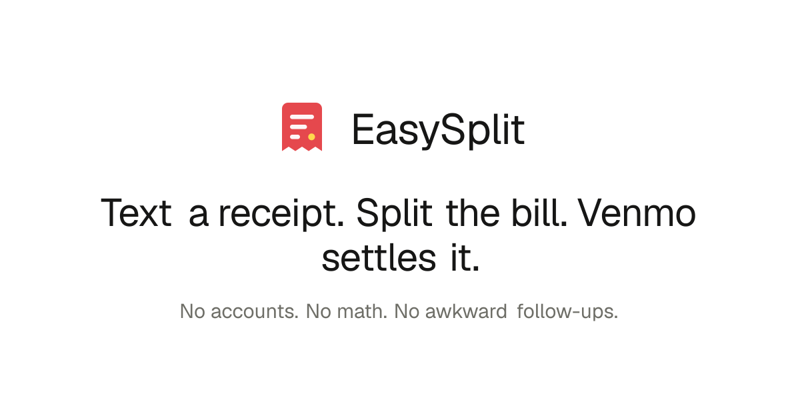
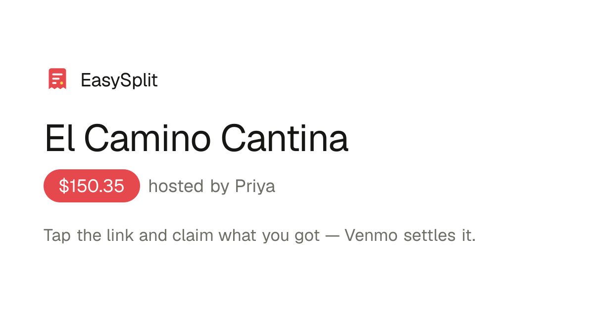

<p align="center">
  
</p>

<p align="center">
  <b><a href="https://easysplitapp.vercel.app">easysplitapp.vercel.app</a></b> — try the live app
</p>

# EasySplit

**Snap a receipt, everyone claims their food, Venmo or Zelle settles it.** The
host photographs the bill, shares one link, and each friend taps — or just types
*"I had the burger and half the fries"* — to claim their items. EasySplit splits
tax and tip proportionally, reconciles **to the exact cent**, and hands everyone
a personalized pay page. No accounts, no app installs, no spreadsheet, no
"who owes what" group text.

When a room link lands in the group chat, the preview already sells it:

<p align="center">
  
</p>

## Try it in 60 seconds

**Live:** open [easysplitapp.vercel.app/new?demo=1](https://easysplitapp.vercel.app/new?demo=1),
walk the create flow with the demo receipt, share the room link with yourself,
and claim items by tapping — or by chatting (*"split the nachos with Maya"*,
*"2 margaritas"*).

**Local:** zero environment variables needed — everything degrades to local
mocks (demo OCR, SQLite, simulated SMS).

```bash
npm install
npm run seed     # creates a fully-claimed demo split, prints room + host links
npm run dev      # http://localhost:3000
```

## The interesting engineering

- **Money that always reconciles.** All money is integer cents; fractional
  ownership ("half the fries", "2 of 3 margaritas") is an exact rational
  `{n, d}` — never a float. Every division uses largest-remainder allocation, so
  `Σ everyone's totals + unclaimed === receipt grand total` holds *by
  construction*, to the cent, every time. A 200-scenario property test (random
  items, claims, thirds, shared plates, tax, tip) asserts the invariant never
  breaks.
- **A deterministic natural-language claim parser.** "I had the burger and half
  the fries" → structured claim actions, with fuzzy item matching
  ("marg" → Margarita), quantity words, split-with-names, on-behalf claims
  ("I'll cover Sam's beer"), and clarifying questions instead of failures. Pure
  function, no LLM, fully unit-tested — and swappable for one later.
- **Self-checking OCR.** Receipt photos are parsed by Claude vision — and every
  receipt carries its own answer key: the printed subtotal. If extracted line
  items don't sum to it, the pipeline escalates once to a stronger
  reasoning-enabled pass with the mismatch spelled out. A rotated, hand-shadowed
  bar receipt with 25 line items and a 22% service charge reconciled to the
  exact cent in testing. Whatever still disagrees is surfaced to the host in a
  correction UI — OCR is never trusted blindly.
- **One SQL dialect, two databases.** Local dev runs zero-config SQLite;
  production runs Supabase Postgres. SQL is written once with `?` placeholders
  behind a tiny async adapter that rewrites them per driver, keeps schema parity
  (bootstrapped idempotently, additive migrations included), and lazy-loads the
  native SQLite module so it never ships to serverless.
- **SMS-first architecture.** A Twilio-compatible `/api/sms/inbound` webhook
  already handles the whole loop — text a receipt photo, get a room link back;
  text "I had the tacos", get your running total and pay link — locally
  simulatable with `curl`, no Twilio account needed (`docs/TWILIO.md`).
- **Abuse-hardened by design.** The OCR endpoint (the one that spends money) is
  rate-limited per IP, per phone number, *and* globally, with a separate cap on
  expensive escalation passes — all DB-backed so limits hold across serverless
  instances. Images are downscaled client-side before upload; structured output
  means the endpoint can't be repurposed as a free vision API.
- **Payments stay safe and boring.** Venmo links are best-effort deep links with
  first-class copy-amount/copy-note fallbacks; Zelle (which has no public
  pay-link standard) gets handle + copy buttons and a best-effort bank-app
  handoff. No automation, no scraping, no credentials — the payer confirms every
  payment inside their own app.

## What's real vs mocked

| Capability | Status |
|---|---|
| Split math, claims (taps + NL parser), rooms, live updates, host dashboard | **Real** |
| Venmo deep links + web links, Zelle handoff, copy-button fallbacks | **Real** (prefill is best-effort by design; payer always confirms in-app) |
| Persistence — SQLite locally, Supabase Postgres + Storage in production | **Real** |
| Receipt OCR | **Real with `ANTHROPIC_API_KEY`** (two-pass, self-checking); without it, an editable demo receipt |
| Inbound SMS/MMS | **Twilio-compatible, locally simulated** — `curl` the webhook; wire creds later (`docs/TWILIO.md`) |

## Routes

| Page | What |
|---|---|
| `/` | Landing |
| `/new` (`?demo=1`) | Create flow — snap/upload → correct items → tip + Venmo/Zelle → share |
| `/split/[id]` | Guest room — claim by tap or chat, live progress |
| `/split/[id]/host?key=…` | Host dashboard — QR share, receipt editor, payment tracking |
| `/split/[id]/pay/[personId]` | Personalized pay page — breakdown, Venmo/Zelle, mark paid |

API contracts live in [`docs/CONTRACTS.md`](docs/CONTRACTS.md): `POST /api/splits`,
`GET/PATCH /api/splits/[id]`, `join`, `claim` (taps or natural language), `pay`,
`POST /api/receipts/parse`, `POST /api/sms/inbound`, `GET /api/files/[name]`.

## Environment

Everything is optional — unset means local mocks (see [`.env.example`](.env.example)).

| Variable | Purpose |
|---|---|
| `ANTHROPIC_API_KEY` | Real receipt OCR via Claude vision |
| `OCR_MODEL` / `OCR_MODEL_STRONG` | Override the fast / escalation OCR models |
| `DATABASE_URL` | Postgres (Supabase transaction pooler) — unset falls back to SQLite |
| `SUPABASE_URL` / `SUPABASE_SERVICE_ROLE_KEY` | Supabase Storage for uploaded images |
| `TWILIO_ACCOUNT_SID` / `TWILIO_AUTH_TOKEN` / `TWILIO_PHONE_NUMBER` | Real SMS/MMS ([`docs/TWILIO.md`](docs/TWILIO.md)) |
| `PUBLIC_BASE_URL` | Public origin for links in SMS replies |

## Architecture

```
UI (Next.js App Router, Tailwind v4)
  └─ src/lib/api.ts        typed client — UIs never call raw fetch
       └─ /api routes      zod-validated, host-key auth on mutations
            └─ src/lib/store.ts   the ONLY module that touches the DB
                 └─ src/lib/db.ts   async adapter: SQLite ⇄ Postgres
```

`src/lib/` is the pure, framework-free foundation: `fraction.ts` (exact
rationals), `money.ts` (largest-remainder allocation), `split-math.ts`
(settlement), `claims.ts` (claim application + over-claim rejection),
`claim-parser/` (the NL parser), `ocr.ts`, `venmo.ts`, `zelle.ts`, `sms.ts`.
Design tokens and direction live in [`docs/DESIGN.md`](docs/DESIGN.md).

## Testing

```bash
npm test   # 80 tests: allocation properties, settlement, claims, NL parser, Zelle
```

## Deploy your own (free)

Runs on Vercel Hobby + Supabase free tier — no code changes, the storage layer
switches on `DATABASE_URL`.

1. Fork/push to GitHub → import at [vercel.com/new](https://vercel.com/new).
2. Create a free [Supabase](https://supabase.com) project; set `DATABASE_URL`
   (Transaction pooler URI), `SUPABASE_URL`, and `SUPABASE_SERVICE_ROLE_KEY` in
   Vercel's Environment Variables. Optionally add `ANTHROPIC_API_KEY` for OCR.
3. Deploy. The schema auto-bootstraps on first request — there is no migration
   step (`supabase/migration.sql` is the human-readable mirror).

For real texting, point a Twilio number's webhook at `/api/sms/inbound` and set
the Twilio vars + `PUBLIC_BASE_URL`.

## Roadmap

Realtime rooms (Supabase Realtime over the existing polling hook), LLM fallback
behind the deterministic claim parser, host nudges ("2 items unclaimed"), and
receipt-confidence highlighting in the correction UI.

## License

MIT — see [LICENSE](LICENSE).
