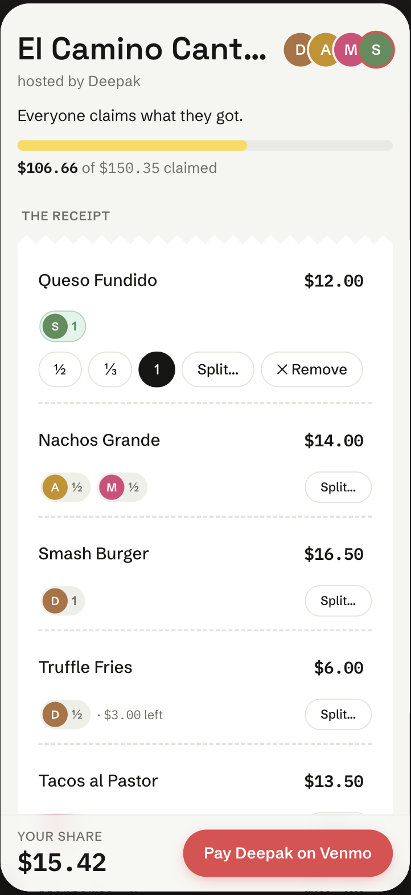
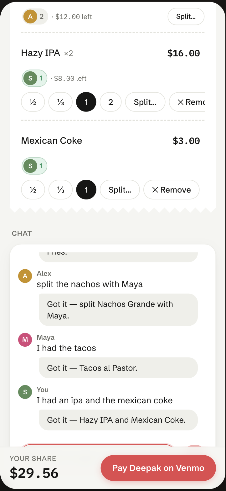
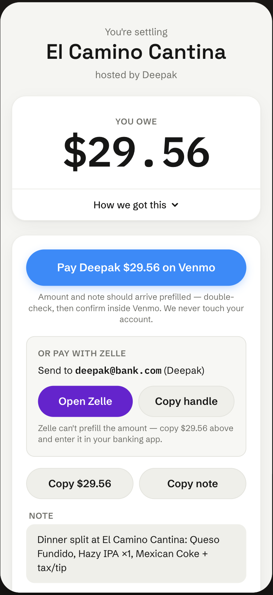

# EasySplit

Split a restaurant bill from one link. The person who paid snaps the receipt;
everyone else taps what they ate (or types "I had the burger and half the
fries") and gets a pay page with their exact share and a Venmo/Zelle button.
No accounts, no installs.

**Live:** [easysplitapp.vercel.app](https://easysplitapp.vercel.app) — the
create flow includes a demo receipt if you don't have a real dinner handy.

<p align="center">
  
  
  
</p>

Local dev needs no environment variables — everything falls back to local
mocks (demo OCR, SQLite, simulated SMS):

```bash
npm install
npm run seed   # creates a demo split with claims, prints room + host links
npm run dev    # http://localhost:3000
```

## How it works

- All money is integer cents and fractional shares are exact rationals
  `{n, d}`. Settlement divisions use largest-remainder allocation, so
  everyone's shares plus the unclaimed remainder always equal the receipt
  total. A 200-scenario property test asserts that invariant.
- Chat claims ("split the nachos with Maya") go through a deterministic
  parser: fuzzy item matching, quantity words, on-behalf claims, and
  clarifying questions instead of errors. No LLM; 30 unit tests.
- Receipt photos are read by Claude vision, checked against the printed
  subtotal, and retried once on a stronger model when the numbers don't add
  up. Anything still off lands in a correction UI, so OCR output is never
  trusted blindly. Without an API key you get an editable demo receipt.
- Local dev runs SQLite; production runs Postgres (Supabase). SQL is written
  once with `?` placeholders behind a small async adapter.
- A Twilio-compatible SMS webhook covers the same loop over text: photo in,
  room link back; "I had the tacos" in, running total and pay link back.
  Locally simulatable with curl, no Twilio account — see
  [docs/TWILIO.md](docs/TWILIO.md).
- The OCR endpoint is rate-limited (per IP, per phone, global, plus a
  separate cap on escalations), DB-backed so limits hold on serverless. The
  room link is the trust boundary: anyone holding it can claim items, like
  passing the paper receipt around; receipt edits and payment confirmation
  require the host key.

## Code layout

`src/lib` is the framework-free core: `money.ts` (largest-remainder
allocation), `fraction.ts`, `split-math.ts`, `claims.ts`, `claim-parser/`,
`ocr.ts`, `venmo.ts`, `zelle.ts`, `sms.ts`. UIs call the typed client in
`api.ts`, API routes validate with zod, and `store.ts` is the only module
that touches the database (`db.ts` adapts between SQLite and Postgres).
Request/response shapes live in [docs/CONTRACTS.md](docs/CONTRACTS.md).

## Deploying

Runs free on Vercel + Supabase: set `DATABASE_URL`, `SUPABASE_URL`, and
`SUPABASE_SERVICE_ROLE_KEY`, plus `ANTHROPIC_API_KEY` if you want real OCR.
The schema bootstraps itself on first request. Every variable is optional
locally — see [.env.example](.env.example). For real texting, point a Twilio
number's webhook at `/api/sms/inbound`.

## Tests

```bash
npm test   # 80 tests: allocation properties, settlement, claims, parser, Zelle
```

MIT — see [LICENSE](LICENSE).
